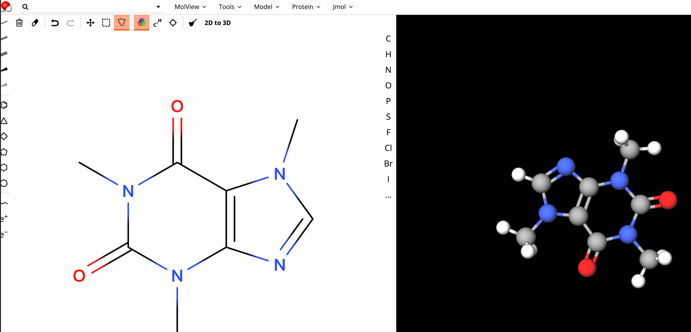
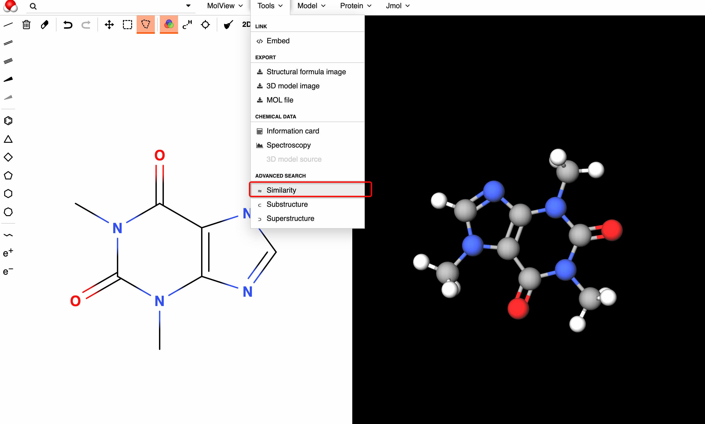

# 向量分子检索

## 前提
1. TairMolSearch 引用外部1个git工程, 需要提前下载 [引用详情](.gitmodules)
    - git submodule init
    - git submodule update

## 快速测试

1. 启动 tair-vector 服务 $VECTOR_HOST  $VECTOR_PORT 
2. 获取镜像并安装
   - wget https://caoduanxin-docker-bj.oss-cn-beijing.aliyuncs.com/tair-molview_1.0.0.tar
   - wget https://caoduanxin-docker-bj.oss-cn-beijing.aliyuncs.com/tair-molserver_1.2.0.tar
   - docker load -i tair-molview_1.0.0.tar
   - docker load -i tair-molserver_1.2.0.tar
3. 启动 tair-molserver 镜像的服务
   - docker run -td -p 35001:5000 -e "TAIR_VECTOR_HOST=$VECTOR_HOST" -e "TAIR_VECTOR_PORT=$VECTOR_PORT" -e "TAIR_VECTOR_PASSWORD=$VECTOR_PASSWORD" tair-molserver:1.2.0
4. 进入 tair-molserver 灌数据 (1w分子结构数据)
   - docker exec -it `docker ps -a |grep tair-molserver |awk '{print $1}'` bash
   - cd script && python3.7 insert_data.py -f test_1w.smi
5. 启动  tair-molview 服务 
    docker run -td -p 8001:80 -e API_URL=http://127.0.0.1:35001 tair-molview:1.0.0
6. 浏览器访问  127.0.0.1:8001

## webserver
- smiles 数据指纹提取、向量化后导入 tair-vector
- 提供分子近似查询，输入的smile指纹提取、向量化后，调用tair-vector的近邻查询

## webclient
- 参考开源molview打包的web客户端
- 1 打开客户端，构造分子 
  
- 2 选择相似检索
  
